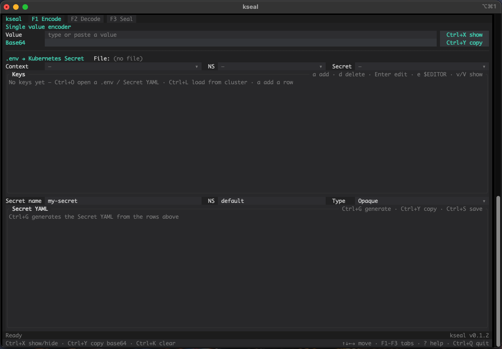

# kseal

Kubernetes Secrets in your terminal: base64 encode/decode, `.env` → Secret YAML,
and native SealedSecret sealing and validation. You don't need the `kubeseal`
binary. kseal ships as one static binary with a TUI and scriptable subcommands.

> **Read-only against the cluster.** kseal lists contexts, namespaces and
> secrets, reads a Secret, fetches the sealed-secrets certificate and asks the
> controller to verify a SealedSecret. It never creates, patches, replaces or
> deletes anything; applying the output is up to you (or your GitOps). The
> mutating `kube::Api` methods are banned in `clippy.toml`, so CI fails if one
> sneaks in.



## Install

**Homebrew** (macOS, Linux)

```bash
brew tap charalamposlamprou/kseal https://github.com/charalamposlamprou/kseal
brew trust charalamposlamprou/kseal     # Homebrew asks once for third-party taps
brew install kseal
```

**Shell installer** (macOS, Linux)

```bash
curl --proto '=https' --tlsv1.2 -LsSf https://github.com/charalamposlamprou/kseal/releases/latest/download/kseal-installer.sh | sh
```

**PowerShell installer** (Windows; an `.msi` is also attached to each release)

```powershell
powershell -ExecutionPolicy Bypass -c "irm https://github.com/charalamposlamprou/kseal/releases/latest/download/kseal-installer.ps1 | iex"
```

**From source** (Rust 1.85+)

```bash
cargo install --locked --git https://github.com/charalamposlamprou/kseal
```

Prebuilt binaries cover macOS (Apple Silicon and Intel), Linux x86_64 and
arm64 (static musl, plus x86_64 glibc) and Windows x86_64.

## Usage

### TUI

Run `kseal` with no arguments. It reads your kubeconfig (`$KUBECONFIG` or
`~/.kube/config`) and picks the current context.

| Tab | What it does |
|---|---|
| **Encode** | Live single-value base64 encoder. `.env` → Secret: open a `.env` or Secret YAML, or load a Secret from the cluster, then edit the key/value table, set name / namespace / type and generate the YAML. The type is guessed from the keys (`tls.crt` + `tls.key` → `kubernetes.io/tls`, …) until you pick one. |
| **Decode** | Live single-value decoder. Open a Secret YAML (multi-document files and `kind: List` work) and get a masked table of its decoded values. |
| **Seal** | Seal the Encode tab's YAML for a context: strict, namespace-wide or cluster-wide scope. The controller is auto-detected per context (editable), or you can seal offline with a certificate. **Validate** asks the controller whether it can decrypt the result. |

Values stay masked until you reveal them. Labels, annotations and `immutable`
survive a load → generate round-trip, and binary values pass through
untouched. Malformed metadata that had to be dropped gets a persistent warning
on every tab. Saved files are written owner-only (`0600`).

#### Keys

| Key | Action |
|---|---|
| `↑` `↓` `←` `→` | Move between fields, following the layout. Inside a table, a YAML pane or a text box they move or scroll there first, and continue to the neighbouring field at the edge |
| `Tab` / `Shift-Tab` | Next / previous field |
| `F1` `F2` `F3` / `Ctrl+N` `Ctrl+P` | Switch tabs |
| `Ctrl+G` | Generate Secret YAML |
| `Ctrl+O` | Open a file: `.env` or Secret YAML, detected automatically (Seal tab: certificate) |
| `Ctrl+L` | Load the selected Secret from the cluster |
| `Ctrl+E` / `Ctrl+T` | Seal / validate |
| `Ctrl+Y` | Copy whatever is focused |
| `Ctrl+S` | Save the YAML / SealedSecret |
| `Ctrl+K` | Clear the focused thing |
| `Ctrl+R` | Reload contexts (also clears the controller cache) |
| `Ctrl+X` | Show / hide masked values |
| `?` | Help |
| `Ctrl+C` / `Ctrl+Q` | Quit |

In a key table: `a` add, `d` delete, `Enter` edit, `e` edit the value in
`$EDITOR` (for multi-line values such as PEM keys or JSON), `v` / `V` show one
or all. Pickers open with `Enter` and filter as you type.

Over SSH, copying uses OSC 52, so the text lands in your *local* clipboard
(your terminal must allow OSC 52; in tmux, enable `set-clipboard`).

### Command line

Every feature also works in scripts:

```bash
kseal encode hunter2                          # aHVudGVyMg==
echo -n aHVudGVyMg== | kseal decode           # hunter2
kseal gen -f prod.env --name db -n prod > secret.yaml
kseal show -f secret.yaml [--reveal]          # decoded keys, masked by default
kseal get db -n prod --format env             # read a Secret as .env (or --format yaml)
kseal seal -f secret.yaml --scope strict -o sealed.yaml
kseal validate -f sealed.yaml                 # exit 1 if the controller can't decrypt it
kseal cert > cert.pem                         # then, offline: kseal seal --cert cert.pem
```

`--context` (or `KSEAL_CONTEXT`) selects a kubeconfig context. The controller
is auto-detected, or set it with `--controller-name` / `--controller-namespace`.
Run `kseal <command> --help` for every flag.

## Development

```bash
cargo fmt --check
cargo clippy --all-targets -- -D warnings
cargo test                 # the sealing interop test also runs if `go` is on PATH
scripts/e2e-kind.sh        # opt-in: throwaway KinD cluster + real sealed-secrets controller
```

Pure logic lives in `src/core.rs` (tested). The TUI in `src/tui/` is
Elm-style: `app.rs` holds the state and update logic and never does I/O,
`mod.rs` runs its effects on tokio, and `ui.rs` renders.

## Releasing

Every PR merged into `main` cuts a release; the default bump is patch. Label
the PR `release:minor` or `release:major` to bump higher, or `release:skip`
to merge without releasing. `tag-on-merge.yml` bumps `Cargo.toml` to the new
version, commits it to `main`, pushes the `vX.Y.Z` tag and starts
`release.yml` ([dist](https://github.com/axodotdev/cargo-dist)). That builds
every target and publishes the GitHub release and installers, then
`publish-homebrew.yml` commits the updated formula to `Formula/` in this repo.

No secrets are needed: everything runs on the built-in `GITHUB_TOKEN`. If
`main` is protected, allow GitHub Actions to push to it (the version bump and
the formula are committed there).

To release by hand, push a version tag that matches `Cargo.toml`, then run
`gh workflow run release.yml --ref vX.Y.Z -f tag=vX.Y.Z`.

## License

MIT
